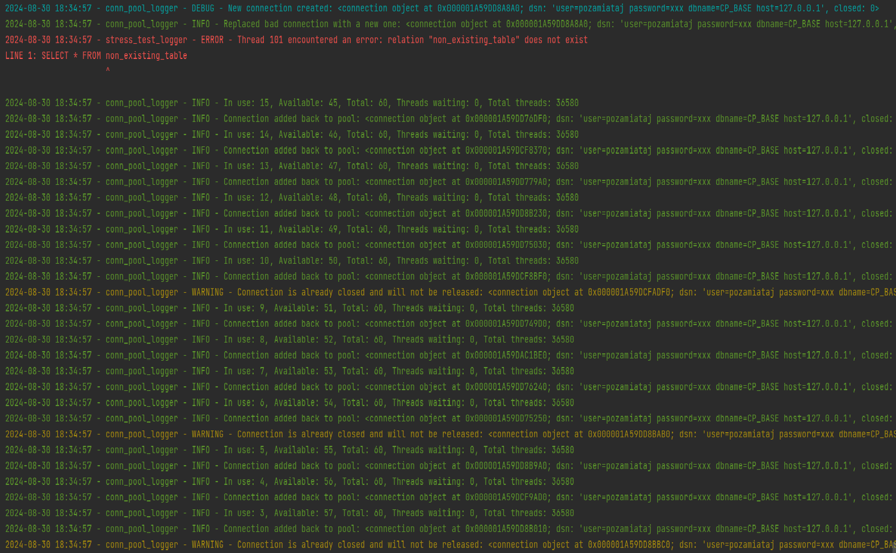

Connection Pool Implementation
--------------------------------------------

This is a simple implementation of a Connection Pool class for managing database connections efficiently.

The ConnectionPool class contains the following methods:

 - initialize_pool: Allocates the initial number of connections to the pool, based on the minimum connection limit (minconn) specified in the configuration.

 - aquire: Obtains a connection from the connection pool. If no connections are available and the pool has not reached its maximum limit, a new connection is created.

 - release: Releases a connection and returns it to the pool if the connection is still open. If the pool is full, the connection is closed instead.

 - handle_connection_error: Handles connections that generate an error by closing the faulty connection and optionally creating a new one if the pool's active connection count falls below the minimum threshold.

 - cleanup_if_needed: Checks if it is time to clean up the connection pool based on a configured interval, and if so, initiates the cleanup process.

 - cleanup_pool: Closes excess connections in the pool that are not currently in use, reducing the pool size to the configured minimum (minconn), thereby freeing up resources.

 - info: Displays information about the current state of the connection pool, including the number of active and available connections.

Additionally, a stress test (stress_test) has been implemented to evaluate the performance and behavior of the pool under load. 
The test parameters, as well as connection pool settings, can be modified in the settings.ini file.

